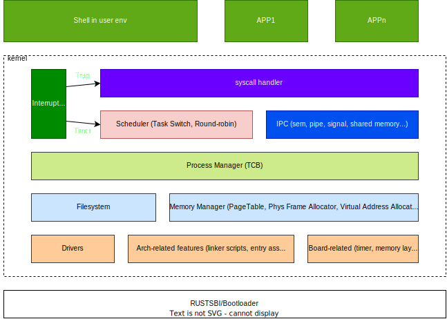

<h2 align="center">Forfun OS</h2>

<p align="center">
   <a href="README.md">English</a>
</p>

## 1 前言

在学习 rcore 之后，为了更加了解其中的细节，萌生了自己写一个操作系统练练手的想法。这个操作系统只是用于个人学习所用，所有设计都是简化处理。虽然简单，但是一个完整的类 unix 操作系统，基本功能均完成。

[Forfun OS 项目源码-Github](https://github.com/croakexciting/forfun-os)



## 1.1 详细设计文档

- [系统调用及任务调度](./doc/cn/syscall.md)
- [内存管理](./doc/cn/memory.md)
- [进程管理和 IPC](./doc/cn/process.md)
- [用户程序开发](./doc/cn/user.md)
- [CPU 架构适配](TBD)
- [BOARD 适配](TBD)

## 2 功能和开发计划

按照初步的设想，需要实现操作系统几大基础功能

- **系统调用**
- **任务调度**
- **内存及 MMU 管理**
- **进程管理**
- **进程间通信**
- **文件系统接入**
- **块设备驱动**
- sd 卡驱动
- 网卡驱动
- 网络协议栈移植

本操作系统计划支持以下架构和 bsp

- riscv
  - **qemu**
  - k210
- armv8
  - **qemu**
  - 树莓派


## 3 快速开始

### 3.1 安装环境

为了方便体验，可以使用 docker 进行运行开发，请预先安装 docker 

另外可以本地安装，安装文档 [本地环境安装](./doc/cn/install.md)

### 3.2 运行 Forfun OS

> 请确认已安装 docker

```
make docker_start

make docker_into

# default run on riscv64 qemu
make run

# 运行正常，会进入 shell
# 运行 hello_world
>> hello_world
hello world!

# 停止内核，目前必须用 kill 才可以停止
make kill
```

[编译和运行文档](./doc/cn/startup.md)

### 3.3 可以运行的用户程序

- hello_world
- loop_test
- sleep_test

## 4 后续计划

加粗的任务应该会完成，剩余的看情况

### 4.1 移植

- **移植到 k210 开发板**
- **移植到树莓派**

### 4.2 内核优化

- **线程功能**
- **多核管理**
- **中断处理**

### 4.3 用户程序

- **用户程序堆优化，从固定堆大小到可动态伸缩**
- **优化 Shell**
- **开发更多内核 feature 测试程序**
- 开发一个类 systemd manager

### 4.4 驱动

- **sd card 驱动**
- 网络驱动和协议栈

## 结语

由于操作系统和编译器等软件基础工具封装的太好了，为软件开发人员提供了一个统一个开发环境，其实他们内在是存在很多与硬件相互协作的过程。这当然是一件好事，但是也造成了软件开发人员对于底层理解不多。如果想要开发更好地软件，还是需要加深对操作系统和编译器的理解。当然这部分知识太多了，没有人可以全部掌握，我们需要的是了解其背后的基本原理，至于各种细节倒不必花太多时间。当理解其背后的原理后，很多之前无法理解的概念就豁然开朗了

计划是完成上述加粗的任务项，剩下的也很有意思，但是可能没有那么多时间了。

另外，本人水平有限，对于操作系统开发更是所知不多，如果您发现博客中有错漏之处，还请不吝赐教。

欢迎在 [Github](https://github.com/croakexciting/forfun-os) 中提 issue，PR，issue 甚至可以只是一条评论，这只是一个玩具项目，所以请放轻松😊