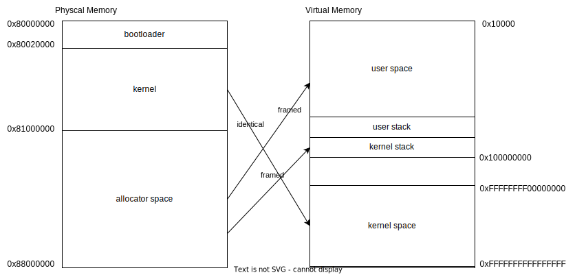

## 1 前言

**本文以 riscv64 架构为例介绍，aarch64 架构会在后续 CPU 适配中介绍**
本章主要介绍 Forfun OS 的内存管理功能。该功能主要设计以下方面

- 页表管理
- 内存区域管理
- 内存集管理
- 物理页帧管理
- 虚拟页面管理
- elf 文件解析和加载

> 请注意，目前不包括对内核堆的管理，内核在启动使用时，预先分配一块固定大小内存，用于堆管理，而不是动态分配内存。

## 2 概念介绍

### 2.1 虚拟内存

在本章之前，我们一直使用的都是实地址模式。实地址模式简单，但存在两个问题，
  - 操作系统需要预先分配一块内存区域，这个区域大小很难决定
  - 每个应用程序需要预先知道自己被放置在哪块区域，并在链接脚本中说明起始地址

因此，前人发明了虚拟内存机制。简单来说，就是每个应用程序独享一块虚拟内存空间，让其产生独占内存空间的错觉（和让其觉得独占 CPU 一样）。同时通过页表机制，建立虚拟内存和物理内存之间的联系。关于虚拟内存的详细介绍可参考 [虚拟内存](https://rcore-os.cn/rCore-Tutorial-Book-v3/chapter4/2address-space.html)

### 2.2 页表

页表用于 虚拟内存 -> 物理内存 的转换过程，CPU 在执行指令时，会根据页表查询到对应的物理内存地址。关于页表的详细说明可参考 rCore 文档介绍 [页表介绍](https://rcore-os.cn/rCore-Tutorial-Book-v3/chapter4/4sv39-implementation-2.html)

每个进程都有独立的地址空间，即一套页表，所以在切换进程时，也需要切换页表。下面就是页表切换函数，它会在 __switch 函数之前执行。

```
// 页表切换函数
// os/src/process/app.rs
pub fn activate(&mut self) {
    let satp: usize = self.satp();
    unsafe {
        satp::write(satp);
        asm!("sfence.vma"); // 刷新块表，确保切换成功
    }
}
```

> 这就是为什么进程切换比线程切换的代价更大，因为进程切换需要切换页表，而线程切换则不用

### 2.3 内存区域和内存集

我们将一段在虚拟内存上连续的区域叫做内存区域，而这些内存区域的集合就叫做内存集。一个进程拥有一个内存集，代码中如下

```
pub struct Process {
    ...
    mm: MemoryManager, # 虚拟内存集
    ...
}
```

比如一个最简单的应用程序，它可能存在如下内存区域

- data 段区域
- text 段区域
- bss 段区域
- kernel stack 区域

这些区域组成的内存集就是这个进程的内存空间

### 2.4 内核访问用户空间

由于页表中的权限设置，用户空间是无法访问内核空间的（当然，由于共享页表，还是存在漏洞可以访问）。而内核是可以访问用户空间地址，但是在访问时，需要修改某个控制寄存器，比如 riscv 架构上需要将 sstatus 寄存器中的 SUM 位置 1，才可访问，否则也会报页错误。

这个改动应该是临时的，在访问之前打开，访问之后就要关掉，可以在 copy_to_user copy_from_user 之类的函数中使用。

## 3 进程地址空间设计

Forfun OS 的进程地址空间设计如下图，这几乎是最简单的设计。
- 内核段和驱动段从 0～FFFFFFFF 物理地址映射到 0xFFFFFFFF00000000 ~ 0xFFFFFFFFFFFFFFFF 的高 4G 空间。采用固定偏移，比如 0x80000000 映射到 0xFFFFFFFF80000000。在页表中采用大页映射，一个页表项可以管理 1G 空间。这样的好处是，既避免恒等映射造成的内核地址不固定，也避免了 Framed 映射造成的虚实地址转换复杂。但是这样的设计只支持 64位 CPU，也只支持外设和内存物理地址处于低 4G 范围的芯片 
- 应用程序中所有段和 kernel stack 则是采用 Framed 的方式映射，该方式会为每个物理页面申请一个物理页帧，并将二者地址映射关系写入页表。
- 一个进程的地址空间中，内核空间和用户空间共享一个页表，这样从用户空间 trap 进入内核空间时，无需进行页表的转换，简化了操作。



## 4 页表功能的实现

页表管理对象结构如下

```
pub struct PageTable {
    // 第一级页表的页号，指向一级页表所在的地址
    root: PhysPage,
    // 存储页表的物理页帧，放在这里只是为了页表实例回收的时候自动将 Frame dealloc
    frames: Vec<PhysFrame>,

    index: usize,
}

// 关键成员函数
pub fn find_pte(&mut self, vpn: VirtPage) -> Option<&mut PageTableEntry>

pub fn map(&mut self, vpn: VirtPage, ppn: PhysPage, flags: PTEFlags) -> Option<PageTableEntry>

pub fn unmap(&mut self, vpn: VirtPage) -> i32

```

对象中有如下关键成员变量

- root，根页表位置，指向第一级页表，相当于是页表查询的入口，这个值是要写道寄存器中的
- frames，这里放到是储存页表的物理页帧，在申请分配后就放在这。当页表实例被删除是，frames 也会被删除，并且会被自动回收
- index, 用于实现页表的遍历，不关键

有如下关键成员函数

- find_pte: 查找页表项，也就是虚实地址间的对应关系，会一直查询到第三级页表
- map: 建立页表项，创建映射关系
- unmap: 删除页表项，删除映射关系


## 5 内存区域和内存集

### 5.1 内存区域

内存区域对象如下

```
pub struct MapArea {
    pub start_vpn: VirtPage,
    // end_vpn 是不包含在内的，也就是一个左闭右开的范围
    pub end_vpn: VirtPage,
    
    map_type: MapType,
    permission: Permission,
    // 放在这里只是为了在 drop 的时候自动执行 dealloc 回收这些物理页帧到 alloctor
    // virtual page => physframe
    frames: BTreeMap<usize, Arc<PhysFrame>>,
    shared: Vec<VirtPage>,
}

pub fn map(&mut self, pt: &mut PageTable) -> i32
pub fn fork(&mut self, pt: &mut PageTable, child_pt: &mut PageTable) -> Self
pub fn cow(&mut self, pt: &mut PageTable, vpn: VirtPage) -> Result<(), &'static str>

```

内存区域主要功能是存放和管理虚拟页面和对应的物理页帧，因为其在虚拟内存上是一块连续区域，因此内存起始值

其中有几个成员函数需要介绍

- map: 为区域中的所有页面申请映射关系
- fork: 在执行 fork 的时候，将本区域 fork 出一个新的，完全一样的区域，之后会加到新的进程的内存集中。注意，为了减少数据拷贝，在 fork 的时候并不会复制页面，还是将所有页面加到 shared vec 中，相当于两个进程中相同页面指向同一个物理页帧。
- cow: 写时复制功能，上述所说 fork 后会产生共用页面，这些页面是只读的，如果此时有写入请求，就要申请一个新的虚拟页面并对应一个新的物理页帧，并将原来页面中的数据拷贝到新的页面中。完成后会将对之前物理页帧的引用删除，当所有进程都不引用该共用页帧时，该页帧会被自动释放。

### 5.2 内存集

内存集对象如下

```
pub struct MemoryManager {
    pt: PageTable,
    kernel_stack_area: MapArea,
    app_areas: Vec<Arc<RwLock<MapArea>>>,
    // 堆可用区域，左闭右开的集合
    buddy_alloctor: Option<BuddyAllocator>,

    _kernel_area: MapArea,
    _device_area: MapArea,
    _dma_area: MapArea,
}

pub fn load_elf(&mut self, data: &[u8], runtime: bool) -> Result<(usize, usize), &'static str>

pub fn fork(&mut self, parent: &mut Self)

```

每一个内存集中主要存储的就是 **页表实例**，**内核栈区域**，**app 区域**， **内核区域**，**外设地址区域**
为了简化处理，其中内核区域和外设地址区域这些 APP 可共享的区域，都采用了 **恒等映射** 的方式加入每个 app 的内存集中。而 kernel stack 和 app area 这些每个 APP 独占的内存区域，都采用了 **Framed（动态映射）** 的方式，申请一些物理页帧，和这些虚拟页面产生映射关系

## 6 总结

本文主要简单介绍了 Forfun OS 的地址空间设计和虚拟内存管理功能。但是内存管理是非常复杂的一部分，本章的介绍可能只是一小部分。

还有很多细节没有介绍，如 COW (Copy On Write)，fork，mmap 等内存管理细节的流程，后面有时间会补齐。

总而言之，实现了内存管理之后，我们向着多进程操作系统迈进了一大步，等我们实现进程和 IPC 功能后，其实基本已经完成了微内核的开发了。