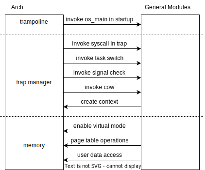

## 1 Introduction

This page will introduce how Forfun OS adapt to a new CPU architecture. We define a set of unified interfaces, when you want to add a cpu architecture, just need to implement these interfaces.

These interfaces can separate to follow aspects

- trap handler
- memory
  - page table
  - data copy between user and kernel
- trampoline

The relative between arch module and kernel general module show as below




## 2 Trap

In arch module, we implement trap_handler and initialize the interrupt registers. When a interrupt triggered, trap_handler analysis trap cause and invoke relative functions. 

For example, if the trap cause is user env syscall, trap handler will invoke trap syscall. 

```
// riscv64 trap_handler
pub fn trap_handler(ctx: &mut TrapContext) -> &mut TrapContext {
    let scause = scause::read();
    let stval = stval::read();
    match scause.cause() {
        Trap::Exception(Exception::UserEnvCall) => {
            ctx.x[33] += 4;
            ctx.x[10] = syscall(ctx.x[17], [ctx.x[10], ctx.x[11], ctx.x[12], ctx.x[13]]) as usize;
        }
        ...
    }
}

// aarch64 trap_handler
pub fn lower_aarch64_synchronous(ctx: &mut TrapContext) -> &mut TrapContext {
    let mut esr: usize;
    unsafe { asm!("mrs {0}, ESR_EL1", out(reg) esr); }
    let ec: usize = (esr >> 26) & 0x3F;
    match ec {
        0x15 => {
            ctx.x[0] = syscall(ctx.x[8], [ctx.x[0], ctx.x[1], ctx.x[2], ctx.x[3]]) as usize
        }
        ...
    }
}
```

## 3 Memory

### 3.1 Page table

The design of cpu virtual mode and page table is very different. So we need to implement page table interfaces for each cpu architect. Include the follow interfaces:

```
pub fn root_ppn() // get the root page table address

pub fn flush_tlb()

pub fn enable_va(id: usize, ppn: usize) // enable virtual mode by asid and root page table address

pub fn pte(ppn: usize, flags: PTEFlags) -> usize // generate pte by target physical address and permission

pub fn ppn(pte: usize) -> usize // get pte contained physical address

pub fn flags(pte: usize) -> Option<PTEFlags> // get pte contained permissions

pub fn is_set(pte: usize, flags: PTEFlags) -> bool // check one specific permission set or not

pub fn set_flag(pte: usize, f: PTEFlags) -> usize // set permissions in pte

pub fn clear_flag(pte: usize, f: PTEFlags) -> usize // clear permissions in pte
```

### 3.2 User space data access

In some architect, such as riscv, kernel can't access user space data randomly. So we need to implement some data copy interface for upper module, which include

```
pub unsafe fn copy_with_user(to: *mut u8, from: *const u8, n: usize)

pub fn copy_usize_with_user(src: usize, dst: *mut usize)

pub fn copy_str_with_user(src: *const i8) -> String

pub fn enable_user_access() // enable kernel access user space function

pub fn disable_user_access() // disable kernel access user space function
```

## 4 Trampoline

I want to introduce the forfun os startup process at here. Now I implement the process in trampoline function.

As we mentioned before, trampoline is a independent program located at the beginning. The trampoline program is the startup program and do the follow works

- setup kernel page table, include the fixed offset map which used during normal running stage and identical map which used during trampoline stage.
- enable virtual mode
- initialize some basic registers
- initialize stack and stack pointer
- jump to os_main

## 5 Conclusion

Forfun os define a set of interface in arch module to simplify cpu architect integration.

Since I already integrate riscv64 and aarch64, the design is proven to be efficient.

Later, I will introduce how to adapt forfun os to a specific board (hardware platform)