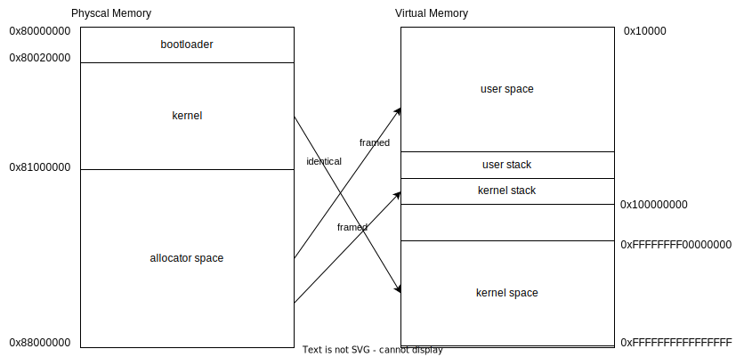

## 1 Introduction

This page will introduce the design and implementation details of memomry manage function

The [rcore memory doc](https://rcore-os.cn/rCore-Tutorial-Book-v3/chapter4/index.html) and [blogos paging implementation](https://os.phil-opp.com/paging-implementation/) explain the virtual mode and page table mechanism very very clear, you can read these doc for more basic knowledge.

The memory manage function basic includes follow parts:

- page table
- memory area manager
- physcal frame allocator
- memory allocator

## 2 Concepts 

### 2.1 Virtual Mode

We use the physical mode until now. The biggest problem with using the physical mode is **every userspace program need to know where it is located at memory, and set correct linker scripts**. But this is obviously unreality.

So, we start using the virtual mode, every program has it's own virtual memory space, very large and contiguous. So the developer don't need to concern the program load address and memory layout.

### 2.2 Page table

The MMU will translate virtual address to physical address based on the page table. We won't step into the details of paga table. **You just need to know that page table store the relationships between physical and virtual memory, MMU translate address via look-up table**.

### 2.3 Virtual space

Each userspace process has its own virtual space. Actually, The MMU just translate address based on page table. So each process has a separate page table. Therefore a page table can represent a virtual space. 

We need to switch page table when switch process. Actually, all the cpu architect define a register which store the page table address, MMU find page table by the register, for example, riscv has the satp register, we only need to change the satp value to switch virtual space.


## 3 Implementation

The Forfun OS process virtual space design show as below



- kernel space: use the fixed offset map method and locate at the high address, from 0xffffffff00000000 to 0xffffffffffffffff. For example, 0x80000000 physical address map to 0xffffffff80000000. Because the offset is fixed, we can use huge page (1GB size) in kernel area and can be created in startup stage.
- user space: This space locate at the low addres. We use the framed map, the dynamic allocation method. This method will request a physical frame for virtual page (4KB size).
- The kernel space and user space share one page table. This design is very efficient because we don't need to switch page table when trap into kernel. But there are some risks, user process may infect the kernel memory area because of some CPU mechanism.

### 3.1 Trampoline

Because the kernel startup in physical mode, so we need to develop a trampoline. The trampoline code include follow functions.

- Initialize some basic register value.
- Create page table for kernel, the page table contains two types of mapping. One is identical map, other is fixed offset map. The identical map only use in startup stage, help cpu find next instruction of the virtual mode enable instruction. Fixed offset map are used kernel running stage.
- Set up virtual mode relative registers, and enable virtual mode.

The implementation of trampoline refs to os/src/arch/riscv64/trampoline.rs, just some boring assembly code because we can't use stack.

Let's take a look at the linker scripts. Because only the trampoline code run in physical mode, so we allocate a seperate section with physical address for trampoline. The other section use the virtual address.

```
# os/src/arch/riscv64/linker.ld.in

SECTIONS
{
    .trampoline ALIGN(4K) :
    {
        strampoline = .;
        KEEP(*(.trampoline.entry))
        etrampoline = .;
    } > TRAMPOLINE

    .kpt (NOLOAD) : ALIGN(4K) 
    {
        skpt = .;
        . += _kpt_size;
        ekpt = .;
    } > TRAMPOLINE

    .text ALIGN(4K) : AT(_load_addr)
    {
        KEEP(*(.text.entry))
        *(.text .text.*)
    } > VIRTUAL

    .rodata : ALIGN(4K)
    {
        *(.rodata .rodata.*)
        *(.srodata .srodata.*)
    } > VIRTUAL

    ...
}

```

The trampoline section contains trampoline code, 4KB is enough for those assembly code. kpt section save the kernel page table, because we use the **Huge Page**, one page table record (8 Bytes) can maintain 1GB virtual memory space, 4KB is also enough. The other sections are very common and generate automatically by compiler.

The trampoline and kpt section are not used after kernel startup, their located physical memory can be reused.

### 3.2 Memory manager

The memory manager instance represent process virtual memory and will be stored in the Process (TCB) instance.

Memory manager struct members shows below

```
pub struct MemoryManager {
    pub pt: PageTable,
    kernel_stack_area: MapArea,
    app_areas: Vec<Arc<RwLock<MapArea>>>,
    // buddy allocator for the dynamic mmap
    buddy_alloctor: Option<BuddyAllocator>,

    // legacy member, not used now
    _kernel_area: Vec<MapArea>,
}
```

The memory manager consists of multi MapArea instance, MapArea is a continuous virtual address space. So the memory manager is a set of MapArea.

Also, it contains a pagetable instance, which manage this memory manager. The buddy allocator dynamic allocate memory area (MapArea).

Its important member function is:

- fork: Initialize the children process memory manager and fork father process user space memory area.
- load_elf: Load a elf file and initialize the process context. Ensure the process ready to run.

### 3.3 Memory area

The MapArea is a continuous virtual address space. The structure shows as below

```
pub struct MapArea {
    // [start_vpn, end_vpn)
    pub start_vpn: VirtPage,
    // end_vpn it self not included in the area
    pub end_vpn: VirtPage,
    
    map_type: MapType,
    permission: Permission,
    // virtual page => physframe
    frames: BTreeMap<usize, Arc<PhysFrame>>,
    shared: Vec<VirtPage>,
}
```

Because it's a continuous memory area, we define start and end virtual page. The map_type define this area's mapping type, include framed, defined. Framed does not specify the target physical frame, will allocated by the physical frame allocator. Defined method can specify the target physical frame, relative virtual page allocate by virtual page allocator.

The permission define this area's permission, R/W/X/U. 

Frames store the physical frames used in this area. And this frames will deallocate and free automatically when drop the MapArea instance because we implement the drop Traits for PhysFrame struct.

Shared store the virtual page which belongs to several process. When fork a process, the father process will share its user memory space with children, these pages will be marked as **shared**, also, the permission will set to can't write. If process want to write data into these pages, will trigger **copy-on-write** mechanism. Kernel will allocate a brand new page and recycle the old page. The copy-on-write mechanism can save the memory usage.

Its key member function is:

- fork: Duplicate itself, create a same MapArea instance, and add the duplication into the new process memory manager. For saving memory usage, we won't create new pages in fork. We share pages with children process.
- map: Allocate physical frame and create pte (page table entry) for every single virtual pages.
- cow: copy-on-write, map a brand new page if process want to write data into shared pages.

### 3.4 Page table

Each memory manager contains a page table manager, which responsible for add and delete pte (page table entry).

The page table manager's struct show as below

```
pub struct PageTable {
    // level-1 page table memory address
    root: PhysPage,
    
    // Physical frame which store the page tables
    frames: Vec<PhysFrame>,

    index: usize,
}

```
The frames are stored in here, and will be deallocated and free automatically when drop the page table instance, always occur when kernel recycle a process resources.

The key member function of page table is:

- find_pte: Use to find the pte pointer by virtual memory (actually, virtual memory is a index)
- map: Generate a pte and set it in page table
- unmap: Delete a virtual page's pte in page table

We can conveniently add and delete pte in page tables by page table manager.

### 3.5 Allocators

The memory manager modules contains two types of allocator.

- Physical frame allocator: This is a global physical memory frame allocator.
- Buddy Allocator: Each memory manager contains a buddy allocator for dynamic memory allocation

#### 3.5.1 Physical frame allocator

Use a very simple allocate strategy. First, we define a continuous physical memory area, and allocate frame one by one in order. If the area start address equals to end address, we will find if there are recycled frame.

When the physframe dropped,  the dealloc function will be triggered and add the frame into recycled vector.

#### 3.5.2 Buddy allocator

The buddy allocator is used for dynamic memory allocation, use [buddy allocation strategy](https://en.wikipedia.org/wiki/Buddy_memory_allocation).

## 4 Conclusion

I think the kernel memory manager function is the most complex and difficult module in Forfun OS, I have spent the most time on it.

But Forfun OS seems like a real kernel after completing these functions, so the effort is worth it.

This page just introduce the implementation of memory manage function in Forfun OS, you can take it as a example, but you still need to learn the basic knowledge about memory and page table.