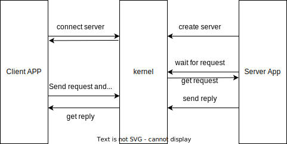

## 1 Introduction

This page will introduce the design and implementation of process manager function and ipc (inter-process communication).

Because we don't have thread function now, each process only have one task, we will add thread function later.

## 2 Process management

Forfun OS is a unix-like OS, especially the process manager. Through the three functions of Fork, Exec and Wait, the father process creates and manage the child process.

The kernel will start the initial process, root process will create children process just like tree, child process is managed by its father.

Forfun OS use a struct named Process as the TCB, don't ask me the reason of the name, I even don't know the TCB concept when I start developing this part.

The Process struct show as below

```
pub struct Process {
    pub tick: usize,            // running tick
    pub status: ProcessStatus,  // task status, ready, running, sleep, exited
    pub pid: PidHandler,        // process id
    pub parent: Option<usize>,  // parent process pid
    pub children: BTreeMap<usize, Arc<Mutex<Self>>>,    // children process instance
    
    ctx: SwitchContext,         // task switch context
    mm: MemoryManager,          // memory manager instance
    asid: AisdHandler,          // memory space id
    fds: Vec<Option<Arc<dyn File>>>,    // file descriptors
    signals: SignalFlags,       // task signals
    signals_mask: SignalFlags,  // task signal mask
    signal_actions: Vec<Option<SignalAction>>,  // task signal relative action
    trap_ctx_backup: Option<TrapContext>,   // trap context back-up
}
```

Just like unix, Forfun OS create and recycle a process by follow three steps

### 2.1 Process Fork

Fork function will create a new process instance and copy father process content into child process. Includes follow details:

- Create a new memory manager
  - Add kernel space pte
  - Create a new kernel stack
- Fork father process user memory space into child process
  - Share the user space
  - Create pte of those user space virtual page
  - Copy trap context into child process, and change the a0 (return value) register to 0, that's why father process get child process pid after execute fork syscall, but child process get 0.
  - Create and initialize the switch context, ensure the child process can be scheduled
  - Allocate pid, asid
  - Copy fds, signal stuff to child process

### 2.2 Process Exec

After we fork a process, we can load a elf file to replace the previous executable file. Fork + Exec is a classic unix-type method of creating process. 

The Exec function mainly includes follow details

- Load and parse the elf file, map all sections into process memory space.
- Build the trap context by process entry address and user stack address.
- Put trap context into kernel stack, replace the previous trap context. CPU will execute from the new entry address after returning to user space.
- Change the process status to ready, ready for schedule.

### 2.3 Process Wait

When a process done, kernel will not recycle its resource immediately until its father process execute wait syscall.

Father process need to specify which child process should be recycled by pid.

Wait syscall handler code show as below, very clear, no need to explain

```
pub fn wait(&mut self, pid: isize) -> isize {
    let mut result = -1;

    for (k, v) in self.children.clone().iter().map(|child| child) {
        if pid == -1 || (pid as usize) == v.lock().pid.0 {
            match v.lock().status {
                ProcessStatus::EXITED(_) => {
                    // drop the child process instance, recycle its resources
                    self.children.remove(k);
                    result = 0;
                }
                _ => {
                    // not finished
                    result = -2;
                    break;
                }
            }
        }
    }

    result
}
```

Parent process find child process instance by pid, if child process status is EXITED, kernel will drop the process instance and recycle its resources.

## 3 IPC

Forfun OS support follow IPC

- Singal
- Pipe
- Named Semaphore
- Named Shared Memory
- Client-Server

### 3.1 Signal

Signal process flow chart show as below


Kernel check signal in trap_handler every time user process trap into kernel.

> Process signal can be injected by kernel and user process

### 3.2 Pipe

Pipe can be used between father process and children process. Father process create a pipe contains two file descriptor, one is used for read and other is used for write. Because child process will inherit father process fds, the father and child process can communicate using pipe.

Pipe contains a fixed size ringbuffer.

```
pub struct Pipe {
    readable: bool,
    writable: bool,
    buffer: Arc<Mutex<RingBuffer>>
}
```

### 3.3 Named Semaphore

The first two types of IPC can only be used between father and child process, there are some restrictions on use. The named semaphore doesn't has those restrictions, process can communicate each-other by **Name**.

Semaphore is very useful for inter-process sync.

### 3.4 Named Shared Memory

Kernel provide named shared memory function for big data communication requirement. This method is very efficient because of the zero-copy mechanism. Shared memory must use with semaphore to ensure the data consistency.

### 3.5 Client - Server

This IPC method kind like the QNX channel, process flow chart show as below.



The request is blocking, client must hold on and wait for the reply.

## 4 Conclusion

This chapter introduce process management and IPC function. After implement this part, the basic function of kernel are done. 

Next chapter, we will introduce the driver and filesystem.