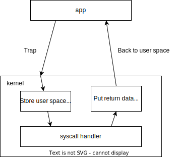
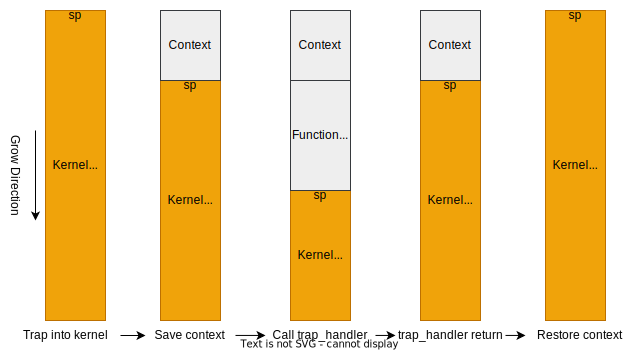

## 1 Introduction

This chapter will introduces the design and implementation details of the syscall functions

The [rcore syscall doc](https://rcore-os.cn/rCore-Tutorial-Book-v3/chapter2/index.html) explains the trap mechanism very clear, you can get more basic knowledge from the doc.

> Syscall: User space program requests a service from kernel to run some higher privilege task. Such as write/read device. You can imagine kernel just like a web server, receive request from user process and execute the request.

## 2 Syscall Process

The syscall execute process shows as below



### 2.1 User space syscall function

Taking the riscv64 architecture as example.

set args into register, and run **ecall** command.

```
# user/src/syscall.rs

fn syscall(id: usize, args: [usize; 4]) -> isize {
    let mut ret: isize;
    unsafe {
        asm!(
            "ecall", # riscv trap into kernel space

            # set args into a0~a3 register, syscall id into a7 register, and get return from a0
            inlateout("x10") args[0] => ret,
            in("x11") args[1],
            in("x12") args[2],
            in("x13") args[3],
            in("x17") id
        );
    }
    ret
}
```

### 2.2 Store User space context

The first thing to do in trap handler is save the user space context, the context is a set of registers, include all general registers, trap cause register, user space process pc and stack pointer.

> The user space pc and stack pointer points to the location where the user process should be executed after recovering from trap.

Even riscv64 and aarch64 have different register design, Array with 34 elements is enough.

```
# os/src/arch/context.rs

#[derive(Clone)]
#[repr(C)]
pub struct TrapContext {
    pub x: [usize; 34],
}
```

Save context in the top of kernel stack

> When the user process trap into kernel space, the kernel stack pointer point to the top of the **kernel stack** area. This is because trap handler is function, you can imagine calling this function. After execution is completed, the stack pointer will automatically return to the initial position (rust compiler do this work).





The implementation of context save please ref to os/src/arch/aarch64/trap.S and os/src/arch/riscv64/trap.S

### 2.3 Trap handler

After save userspace context, call the trap_handler. 

> Actually, kernel code only run in trap_handler at runtime. The kernel only runs when a trap handler is invoked.

The trap handler execute relative code based on trap cause, mainly include

- syscall: execute syscall by syscall id, such as write, read, sleep
- timer interrupt: switch task (introduce later)
- memory fault: copy on write (introduce later) or throw a signal fault
- other fault: throw signal fault

```
# syscall called in trap_handler

# ec is the aarch64 trap cause, 0x15 means user process trap request 
match ec {
    0x15 => {
        ctx.x[0] = syscall(ctx.x[8], [ctx.x[0], ctx.x[1], ctx.x[2], ctx.x[3]]) as usize
    }
    0x24 => {
        
    }
    _ => {
        panic!("unsupported ec value: {}", ec);
    }
}

# syscall function call other functions based on syscall id
pub fn syscall(id: usize, args: [usize; 4]) -> isize {
    match id {
        SYSCALL_READ => sys_read(args[0], args[1] as *mut u8, args[2]),
        SYSCALL_WRITE => sys_write(args[0], args[1] as *const u8, args[2]),
        SYSCALL_OPEN => sys_open(args[0] as *const i8, args[1] as usize),
        # ...
    }
}
```

### 2.4 Restore

After execute trap_handler, directly jump to __restore function. restore process restore all user space context and back to user space. __restore implementation ref to os/src/arch/aarch64/trap.S and riscv64/trap.S 

> As the kernel stack changes picture shows, the kernel stack sp automatically point to the trap context after call trap_handler


## 3 Conclusion

Syscall is a very important part of kenrel. Because of the privilege restrict, user space process can't communicate with hardware or access to public resource. So the user process request kernel to do these work.