## 1 前言

本章主要介绍 Forfun OS 的进程管理和 IPC 功能。目前简单考虑，没有设计线程功能，所以每一个进程就是一个任务，后期再考虑增加线程功能。

对于微内核来说，IPC 是非常重要的功能，因为微内核不提供文件系统，也不提供驱动，这些基础组件都是一个独立的用户进程。因此内核需要提供方便好用的 IPC 功能，帮助进程间通信。

## 2 进程管理

Forfun OS 的进程管理采用经典的 UNIX 式方式，通过 Fork，Exec，Wait 三个函数实现父进程对子进程的创建到回收。内核在启动时，会启动初始进程，再由初始进程启动子进程。子进程完全由父进程进行管理。

一个进程只存在一个任务，因此进程管理和任务控制块放在一个对象里即可，在 Forfun OS 中叫做 Process，内容如下

```
pub struct Process {
    pub tick: usize, // 运行时间片
    pub status: ProcessStatus, // 任务状态， ready，running，sleep，exited
    pub pid: PidHandler,
    pub parent: Option<usize>, // 父进程
    pub children: BTreeMap<usize, Arc<Mutex<Self>>>, // 子进程
    
    ctx: SwitchContext, // 任务上下文
    mm: MemoryManager, // 内存集
    asid: AisdHandler, // 内存空间 id
    fds: Vec<Option<Arc<dyn File>>>, // 文件描述符
    signals: SignalFlags, // 信号，用于 ipc
    signals_mask: SignalFlags, // 信号掩码
    signal_actions: Vec<Option<SignalAction>>, // 信号量 handler
    trap_ctx_backup: Option<TrapContext>, // trap 上下文备份
}

```

主要通过以下三个函数管理进程从创建到回收

### 2.1 进程 Fork

UNIX 采用 Fork + Exec 的组合加载子进程，其实如果加载一个新的 elf 文件，反而用一个 syscall 更加简单。因为 fork 过程需要考虑很多情况。

但等我发现这个问题时，已经开发过半了，所以就接着完成了。在这里，我们不讨论这两种方式的优劣，只是介绍下我的实现。

Fork 的过程如代码所示

```
os/src/process/app.rs
pub fn fork(&mut self) -> (Weak<Mutex<Self>>, usize) {
    let mut mm = MemoryManager::new();
    mm.fork(&mut self.mm);
    let switch_ctx = SwitchContext::new_with_restore_addr_and_sp();
    let pid = pid::alloc().unwrap();
    let key = pid.0;
    let tick = self.tick;
    let fds = self.fds.clone();
    let signals =  self.signals;
    let signals_mask = self.signals_mask;
    let signal_actions = self.signal_actions.clone();
    ...
}

```

主要包括下如下方面

- 创建新的 MemoryManager
  - 恒等映射内核空间
  - 恒等映射设备寄存器地址
  - 创建新的 kernel stack
- 将父进程的 MemoryManger fork 到子进程
  - 将用户区域所有 Memory Area 都改为只读，并且将引用技术 +1，为写时复制做准备
  - 生成子进程页表，并完成映射关系创建
  - 将父进程的 trap 上下文复制到子进程中，并将 a0 寄存器修改为 0（也就是 syscall 返回值）
- 创建一个新的 **任务上下文** 使子任务可以从内核态返回用户态
- 创建 pid，创建时间片，创建默认的文件描述符，进程信号量


在完成 fork 之后，父子进程即可独立运行了。父进程会获得子进程的 pid

### 2.2 进程 Exec

Exec syscall 是在当前进程中加载 elf 文件，并切换运行 elf 定义的程序，之前运行的程序则会被放弃

Exec 代码如下

```
pub fn exec(&mut self, elf: &[u8]) -> Result<(), &'static str> {
    // unmap all app area, for load elf again
    self.mm.unmap_app();
    let (sp, pc) = self.mm.load_elf(&elf, true)?;
    let trap_ctx = TrapContext::new(pc, sp);
    let kernel_sp = self.mm.runtime_push_context(trap_ctx);
    self.ctx = SwitchContext::new_with_restore_addr(kernel_sp);
    self.set_status(ProcessStatus::READY);
    Ok(())
}
```

步骤如下

- 加载 elf 文件，会解析 elf 文件，并将每一段添加到 MemoryManager 中，并创建页表映射
- 将解析得到的用户程序 **entry 指令地址** 和 **用户栈起点** 填入 Trap 上下文。
- 将 Trap 上下文填入 kernel stack 中，替换之前的 trap 上下文。这样 syscall 返回到用户态时，会自动从新程序的 entry 地址开始执行
- 将进程状态改为 Ready，接受调度器调度

### 2.3 进程 Wait

当子进程运行完成后，所占用的资源并不会立刻释放，而是需要父进程使用 wait syscall 获得子进程 return code。会在该 syscall 中删除子进程实例，并会自动删除子进程占用的内存资源。

wait 实现代码如下

```
pub fn wait(&mut self, pid: isize) -> isize {
    let mut result = -1;

    for (k, v) in self.children.clone().iter().map(|child| child) {
        if pid == -1 || (pid as usize) == v.lock().pid.0 {
            match v.lock().status {
                ProcessStatus::EXITED(_) => {
                    self.children.remove(k);
                    result = 0;
                }
                _ => {
                    // 还没结束
                    result = -2;
                    break;
                }
            }
        }
    }

    result
}

```

父进程根据 pid 找到对应的子进程实例，查询状态，如果状态为 EXITED，则删除该进程实例，完成资源释放。

> 调度器中会有每个任务的引用，类似于 c++ 中的 Weak_ptr。在每次调度时，会尝试获取实例，当进程实例被删除是，获取失败，调度器就会将该引用从调度器中删除。

## 3 IPC

由于 Forfun OS 是一个微内核系统，因此驱动，文件系统等基础组件都放在用户层。这种设计中，进程之前通信更加频繁，内核需要提供多种 IPC 供使用。
Forfun OS 支持的 IPC 如下

- Singal                信号
- Pipe                  管道
- Named Sem             命名信号量
- Named Shared Memory   命名共享内存
- Client-Server         类似于 QNX 的 Channel

### 3.1 Signal

进程信号起到进程间同步的作用，除了一些固定的错误信号外，还可以定义信号量的 handler

信号处理流程如下



检查信号的工作是在 trap_handler 里执行，这样用户进程每次进入内核空间时，就会自动执行检查

```
// 检查 signal
let signal_code = signal_handler();
match signal_code {
    SignalCode::IGNORE => {
        // do nothing
    }
    SignalCode::Action(handler) => {
        # 调用 signal handler
        // save ctx for sigreturn
        save_trap_ctx();
        ctx.sepc = handler.handler;
        ctx.x[10] = handler.sig;
    }
    SignalCode::KILL(e) => {
        # 退出进程
        exit(e)
    }
}
```

> 进程的信号是由其他进程发送的，以及内核注入的

### 3.2 Pipe

实现了父子进程间的管道通信，没有实现命名管道。父进程创建一个管道，得到两个文件描述符，一个只能读取管道，一个只能写入管道。然后创建子进程，继承父进程的文件描述符。此时父子进程间可以使用管道进行通信了

管道创建后，会申请一个固定大小的 ringbuffer，这个 buffer 大小不宜太大，接收端最好等待接收，也可以实现同步的功能。

### 3.3 Named Sem

前面两种 IPC 方式都需要知道 pid，管道甚至只能在父子进程间使用，限制比较大。而命名信号量则没有该限制，而是根据 **名称** 实现通信。信号量用于进程间同步，一边等待，另一边释放，实现同步功能。

### 3.4 Named Shared Memory

对于大数据量的 IPC 需求，内核提供了 **命名共享内存** 功能，两个进程通过共享内存，减少两次拷贝（正常需要四次拷贝）。共享内存需要配合信号量使用，没有同步机制无法使用。

### 3.5 Client-Server

该 IPC 类似于 QNX channel 机制，由客户端发送请求，服务端处理请求并回复客户端。客户端通过命名找到服务端。通信流程如下。


客户端请求是阻塞的，一定要等到 server 端的回复，而服务端 wait_request 可以设置超时时间，方便监听多个 request

## 4 总结

本文介绍了进程的创建、管理和 IPC 功能，实现了这部分内容后，基本实现了微内核的基础功能。下一章我们将介绍下用户程序如何开发，尤其详细介绍下文件系统和 Shell 的实现。实现这两个后，我们可以在 shell 中加载进程运行。