## 1 前言

本章主要介绍 Forfun OS 的系统调用和任务调度功能的设计和实现细节

- 系统调用：指运行在用户空间的程序向操作系统内核请求需要更高权限运行的服务
- 任务调度：操作系统为每个任务分配时间片，轮流执行任务，让每个用户进程认为自己独占了 CPU

这两章实现参考 rCore-OS，可以参考 rCore 中的以下两章

[批处理系统](https://rcore-os.cn/rCore-Tutorial-Book-v3/chapter2/index.html)

[多道程序与分时多任务](https://rcore-os.cn/rCore-Tutorial-Book-v3/chapter3/index.html)


## 2 系统调用

系统调用流程如下图



用户空间执行系统调用后，触发软件中断，进入 trap_handler

### 2.1 用户空间 syscall 

```
# user/src/syscall.rs

fn syscall(id: usize, args: [usize; 4]) -> isize {
    let mut ret: isize;
    unsafe {
        asm!(
            "ecall", # riscv trap into kernel space

            # set args into a0~a3 register, syscall id into a7 register, and get return from a0
            inlateout("x10") args[0] => ret,
            in("x11") args[1],
            in("x12") args[2],
            in("x13") args[3],
            in("x17") id
        );
    }
    ret
}

```

### 2.2 保护用户上下文
首先保存用户上下文，包括如下内容

```
# os/src/trap/context.rs
pub struct TrapContext {
    pub x: [usize; 32], // 所有的通用寄存器
    pub sstatus: usize, // trap 原因
    pub sepc: usize, // 回到用户空间，pc 指向的位置
}
```

上下文保存过程，将上下文保存在 kernel stack 的最顶端
> 每次从用户空间进入内核时，kernel stack sp 都会始于预设的栈顶端，这是因为在恢复到用户空间时，kernel stack sp 会回到预设的栈顶端。比如 forfun-os 中，我们将 kernel stack sp 初始值设为 0x9000_0000, 那么每次 trap 进入内核时，kernel_stack sp 都是这个值，这是一个非常自然的过程。

```
# os/src/trap/trap.S

__alltraps:
    csrrw sp, sscratch, sp
    # now sp->kernel stack, sscratch->user stack
    # allocate a TrapContext on kernel stack
    addi sp, sp, -34*8
    # save general-purpose registers
    sd x1, 1*8(sp)
    # skip sp(x2), we will save it later
    sd x3, 3*8(sp)
    # skip tp(x4), application does not use it
    # save x5~x31
    .set n, 5
    .rept 27
        SAVE_GP %n
        .set n, n+1
    .endr
    # we can use t0/t1/t2 freely, because they were saved on kernel stack
    csrr t0, sstatus
    csrr t1, sepc
    sd t0, 32*8(sp)
    sd t1, 33*8(sp)
    # read user stack from sscratch and save it on the kernel stack
    csrr t2, sscratch
    sd t2, 2*8(sp)
    # set input argument of trap_handler(cx: &mut TrapContext)
    mv a0, sp
    call trap_handler
```

### 2.3 处理 trap 和 syscall

```
# os/src/trap/mod.rs

pub fn trap_handler(ctx: &mut TrapContext) -> &mut TrapContext {
    let scause = scause::read();
    let stval = stval::read();
    match scause.cause() {
        Trap::Exception(Exception::UserEnvCall) => {
            # sepc += 4 是将其地址增加 32bit，正好指向用户 app 中调用 syscall 的下一条指令
            ctx.sepc += 4;
            # 在此调用 syscall handler
            ctx.x[10] = syscall(ctx.x[17], [ctx.x[10], ctx.x[11], ctx.x[12], ctx.x[13]]) as usize;
        }

        ...

# os/src/syscall/mod.rs
pub fn syscall(id: usize, args: [usize; 4]) -> isize {
    match id {
        # 根据 syscall id 执行相应的系统调用
        SYSCALL_READ => sys_read(args[0], args[1] as *mut u8, args[2]),
        SYSCALL_WRITE => sys_write(args[0], args[1] as *const u8, args[2]),
        SYSCALL_OPEN => sys_open(args[0] as *const i8),
        SYSCALL_LSEEK => sys_lseek(args[0], args[1]),
        SYSCALL_MMAP => sys_mmap(args[0] as usize, args[1] as usize),
        ...
        _ => panic!("Unsupported syscall id: {}", id),
    }
}

```

### 2.4 恢复

执行 syscall 之后，回到 trap_handler，执行 trap_handler 后会自动回到 __restore 函数，进行恢复过程

trap_handler 会返回用户上下文 trap_context 的地址，__restore 中会从 a0 寄存器获取该地址，并恢复上下文

```
# os/src/trap/trap.S
__alltraps:
    ...
    call trap_handler
    # call __resotre after trap_handler
__restore:
    # case1: start running app by __restore
    # case2: back to U after handling trap
    # Because of we add switch.S, the sp will be set correct before call __restore
    # mv sp, a0
    # now sp->kernel stack(after allocated), sscratch->user stack
    # restore sstatus/sepc
    ld t0, 32*8(sp)
    ld t1, 33*8(sp)
    ld t2, 2*8(sp)
    csrw sstatus, t0
    csrw sepc, t1
    csrw sscratch, t2
    # restore general-purpuse registers except sp/tp
    ld x1, 1*8(sp)
    ld x3, 3*8(sp)
    .set n, 5
    .rept 27
        LOAD_GP %n
        .set n, n+1
    .endr
    # release TrapContext on kernel stack
    addi sp, sp, 34*8
    # now sp->kernel stack, sscratch->user stack
    csrrw sp, sscratch, sp
    # back to user env
    sret
```

## 3 任务切换

任务切换流程如下



任务切换过程中主要涉及**任务上下文**的切换，它和 Trap 上下文是不同的，结构体如下，请仔细看代码中的注释内容，是任务切换的关键。

```
pub struct SwitchContext {
    // 事实上，这个上下文中保存的寄存器都是和进入和退出函数相关的寄存器
    // 由于某个任务背切换的位置都是在执行 __switch 时，因此 ra 寄存器保存的是退出 __switch 后的指令地址
    // 这样在切换回到某个任务时，调用 ret，pc 会自动指导 ra 寄存器保存地址，也就是 __switch 的下一条指令
    // 因为这个操作对于某个任务来说，它只能感觉到在正常执行一个函数，只不过中间被打断过，但是它是无感的
    // 因此只需要保存调用函数相关的寄存器即可，非常巧妙的设计

    ra: usize, // 函数返回地址
    sp: usize, // 栈指针
    s: [usize; 12] // s0~s11 储存函数调用和恢复信息
}
```


这里要重点解释下 kernel stack，通过 kernel stack 这个概念，我们就可以清晰的理解任务是如何切换的了

### 3.1 kernel stack

kernel stack，顾名思义就是 **内核栈** ，这是其最基础的理解。事实上，内核中的栈分为两类，第一类就是内核作为软件本身必须带有的栈，这个栈和每个应用程序中的栈空间是完全一样的。当内核启动，并在进入内核空间之前，只会使用这个栈。

而这里所说的 kernel stack，是指每个任务（线程）对应的内核栈，每个任务都需要一个内核栈，是应用程序 trap 进入内核后，使用的栈。内核栈中存储每个任务 trap 之前的上下文现场，因此，**如果想要切换到某个任务，就需要先切换到它对应的内核栈，接下来执行 trap 恢复流程，就自然的切换到了这个任务**

打比方来说，内核是一个电源，它有很多个插头（内核栈），但是每次都只能像一个插头供电。应用程序就是需要电源的设备，每个任务都插在一个插头上。电源会不停选择下一个切换的插头是什么，它只需要将电源通向某一个插头，就会自然的将电流输送到对应的设备。

### 3.2 控制流切换

**任务上下文**切换使用 __switch 函数，可以不用关心它的细节，它的用处就是将当前这在运行的上下文和即将运行的上下文进行切换

如我们上面所说，任务上下文中的寄存器其实就是代表着一个函数，而每个函数都运行在一个控制流中，因此我们可以近似得到

**切换任务上下文 = 切换运行函数 = 切换运行函数所在的控制流**

当切换完成后，CPU 会直接跳到切换后的函数中运行，由于 ra，sp，s0~s11 寄存器均切换，因此正在运行的函数退出后，会继续执行调用它的函数。

下图结合代码说明了是如何实现控制流切换，提供了一个切换的例子


如上图所示，定时器中断触发时，任务被打断，进入 kernel，执行 back_to_idle ，将控制权交还，idle 控制流实际运行在 run_task 函数的 loop (while) 循环中。当 idle 得到控制权后，会从上次被打断的地方继续执行，被打断的地方也就是运行 __switch 的地方，继续执行相当于从 loop 循环开始的地方。继续执行后，会由调度器选择下一个运行的任务，随后会从 idle 流切换到被选中的任务流。由于任务流被打断的地方一定在 back_to_idle 函数中 __switch ，因此交还后，会接着执行，也就是完成 back_to_idle，返回 trap_handler，直到 restore 回去。

**在这个过程中，每个任务认为自己只是执行了一个简单的 trap 任务。但实际上执行到一半，被暂停了，直到再次轮到它执行时，才把后面一半的 trap 流程执行完。这对于任务来说是无感的。**

## 4 任务控制块

每个任务是由任务控制块代表的，其中存储着这个任务所有重要信息。Forfun-OS 中，任务控制块设计如下

```
pub struct Process {
    pub tick: usize, # 运行时间片
    pub status: ProcessStatus, # 任务状态， ready，running，sleep，exited
    pub pid: PidHandler,
    pub parent: Option<usize>, # 父进程
    pub children: BTreeMap<usize, Arc<Mutex<Self>>>, # 子进程
    
    ctx: SwitchContext, # 任务上下文
    mm: MemoryManager, # 虚拟内存管理实例，下一章介绍
    asid: AisdHandler,
    fds: Vec<Option<Arc<dyn File>>>, # 文件描述符，后面介绍
    signals: SignalFlags, # 信号，用于 ipc
    signals_mask: SignalFlags,
    signal_actions: Vec<Option<SignalAction>>,
    trap_ctx_backup: Option<TrapContext>,
}
```

## 5 总结

本章介绍了 syscall 和 任务切换的实现，这部分完成后，其实已经可以作为一个操作系统使用了。如 RTOS 一般就只有任务调度的功能，连 syscall 都不需要。当然产品化的 RTOS 是有大量的工作要做的，这里只是说完成任务调度已经可以实现一个基础的 RTOS 了。

下一章会介绍内存管理，主要是虚拟内存和页表的管理，可以说是操作系统中最重要的部分。